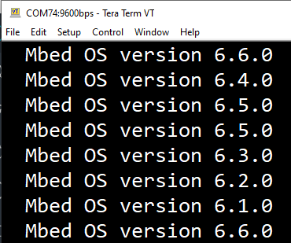

#22_BufferedSerial_mbedos6
Testing and evaluating [BufferSerial](https://os.mbed.com/docs/mbed-os/v6.6/apis/serial-uart-apis.html) API as a replacement for the depricated `Serial` class for using it with nBlocsStudio Nodes.

## Testing with os6 versions
BufferedSerial tested to be working with all versions of mbed-os6 but not with the last version of mnbed-os5
 *  mbed os6.6:heavy_check_mark:
 *  mbed os6.5:heavy_check_mark:
 *  mbed os6.4:heavy_check_mark:
 *  mbed os6.3:heavy_check_mark:
 *  mbed os6.2:heavy_check_mark:
 *  mbed os6.1:heavy_check_mark:
 *  mbed os6.0:heavy_check_mark:
 *  mbed os5.15:x:
 

 

## Links
 *  [BufferedSerial](https://os.mbed.com/docs/mbed-os/v6.6/apis/serial-uart-apis.html)
 *  [Mbed 6 how to use printf on multiple serial ports](https://forums.mbed.com/t/mbed-6-how-to-use-printf-on-multiple-serial-ports/8830/2)
 *  [SerialStream](https://os.mbed.com/users/MultipleMonomials/code/SerialStream/)
 *  [Deprecate Stream and Serial #5655](https://github.com/ARMmbed/mbed-os/pull/5655)
 *  [Serial class in Mbed OS 6?](https://forums.mbed.com/t/serial-class-in-mbed-os-6/9647/2)
 *  [Remaping printf on custom boards in Mbed 6](https://forums.mbed.com/t/remaping-printf-on-custom-boards-in-mbed-6/8853/2)

## Revision Parameter in Schematic Design csv file (bom)
[issue #8](https://github.com/nblocksStudio/studio2.0_experimental/issues/8)

### What
A new version for a Node like [StringSerial](https://github.com/nBlocksStudioNodes/nblocks_stringserial) using mbed-os6`BufferedSerial` instead `Serial`, requires automatic version control during nBlocksStudio translation.

### why:
The new mbed-os6 Node version will disrupt the translation and build of older projects based on mbed-os5  

### How
A possible implementation is to add a new parameter `Revision` to the Schematic Design, with content the `hash` of the required Node git version. This new parameter to be used by a new version of the nBlocksStudio translator to git-checkout the revision of the Node after the git-clone, instead of adding normally the parameter to the main.cpp.

### Benefits for using mbed-os6
 *  nBlocksStudio compatibility with latest mbed features on Low-Power and IoT
 *  Probably unblock the completion of Modbus Nodes based on Serial class